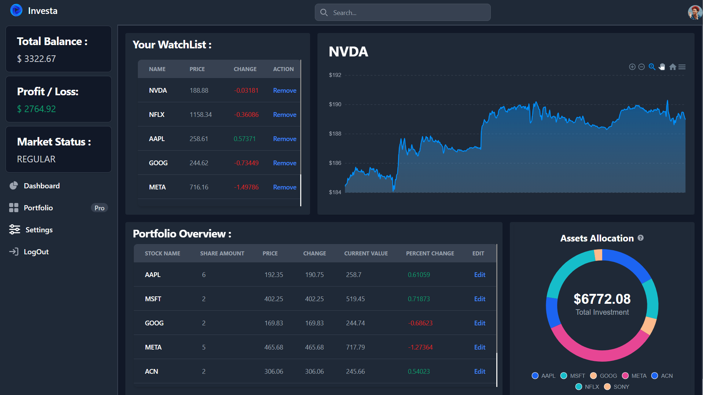

# Stock Market Simulator
Stock Market Simulator buy or sell stocks with real time data with an intreactive and customizable user dashboard.

Welcome to Investa! 🌟 Here's how to get started:<br>
This is a stock market simulator

* **Create Your Account:** Sign up to start using Investa.
* **Demo Money:** Once registered, you'll receive $10,000 in virtual money to begin trading.
* **Buying Stocks:** Use your demo money to buy stocks. Simply search for the stocks you're interested in, and purchase them directly from your personalized dashboard.
* **Real-Time Updates:** Stock prices update in real-time using the Yahoo Finance API, so you always have the latest market data at your fingertips.
* **Track Your Portfolio:** Monitor your assets and watch their performance over time. Your interactive dashboard makes it easy to see how your investments are doing and make informed decisions.

## Dashboard
Dashboard displays a watchlist with an interactive graph, a portfolio overview of the holding stocks, and the total stock allocation. 
Your Investa dashboard is your personal trading hub! Here's what it shows:

* **Total Balance:** See the total value of your account, investments.
* **Profit/Loss:** Track your overall gains or losses in real-time.
* **Market Status:** Know whether the market is closed, regular, pre-market, or post-market.
* **Watchlist:** Keep an eye on the stocks you're interested in.
* **Watchlist Graphs:** Visualize the performance of stocks on your watchlist.
* **Portfolio Overview:** Get a detailed summary of all your investments.
* **Asset Allocations:** See how your investments are distributed across different assets.



## Details (Buy/Sell) Page
This page allows users to monitor graphs and live stock prices, as well as buy and trade virtual stocks.
The search page is your go-to for detailed stock information and trading. Here's what you can do:

* **View Stock Details:** See the current price, previous close, and detailed stats like 52-week high/low, market day high/low.
* **Real-Time Price Chart:** Track the stock's performance with an up-to-date price chart.
* **Market Status:** Know whether the market is closed or open.
* **Buy/Sell Stocks:** If you hold stocks, you can easily buy or sell directly from this page.
* **Watchlist:** Add stocks to your watchlist for future tracking.


## Run Locally 
1. Clone the repository:
```
git clone https://github.com/sakshamssr/Investa.git
```
2. Navigate to the project directory:
```
cd Investa
```
3. Install dependencies:
```
pip install -r requirements.txt
```
4. Run the Django development server:
```
python manage.py runserver
```
5. Access the application by visiting http://localhost:8000 in your web browser.
```
http://localhost:8000
```

## Contributing
Contributions are welcome! Please fork the repository and submit a pull request with your changes. For major changes, please open an issue first to discuss what you would like to change.

